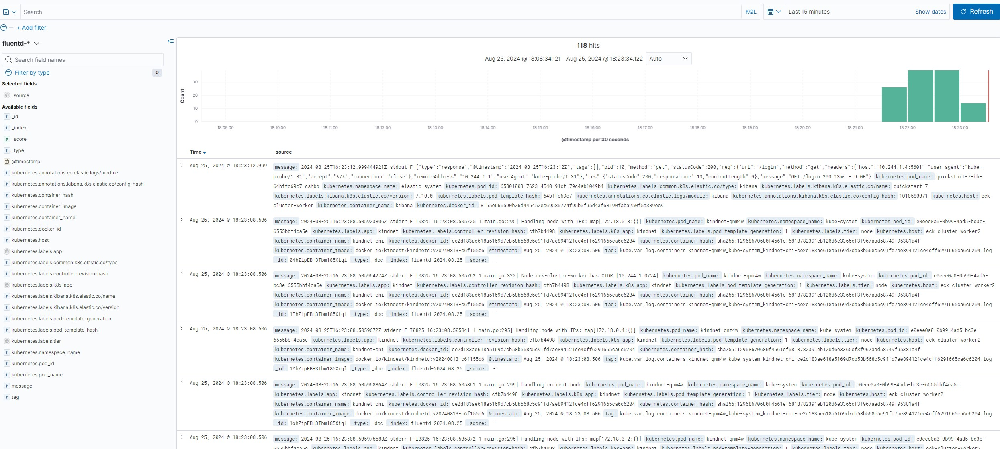

# elastic-stack install steps
> [!NOTE]
> Elastic user password required in fluentd values is being created as secret after elasticsearch deployment.
> 
> fluentbit output port and fluentd input port need to align.
> 
> Kibana scope for es-instance basing on `elasticsearchRef`.
> 
> Fluentd es plugin requires specific version (newest comes with newest client - to fix this build new image with proper plugin) of elasticsearch client.

- Install ECK operator 2.8 (or other)
```
helm repo add elastic https://helm.elastic.com
helm repo update
helm install elastic-operator elastic/eck-operator -n elastic-system --create-namespace --version 2.8
```
- Deploy Elasticsearch 7.10.0 (or other)
```
kubectl apply -n elastic-system -f - <<EOF
apiVersion: elasticsearch.k8s.elastic.co/v1
kind: Elasticsearch
metadata:
  name: quickstart-7
spec:
  version: 7.10.0
  nodeSets:
  - name: default
    count: 1
    config:
      node.store.allow_mmap: false
EOF
```
- Deploy Kibana 7.10.0 (or other)
```
kubectl apply -n elastic-system -f - <<EOF
apiVersion: kibana.k8s.elastic.co/v1
kind: Kibana
metadata:
  name: quickstart-7
spec:
  version: 7.10.0
  count: 1
  elasticsearchRef:
    name: quickstart-7
EOF
```
- Deploy fluent-bit as forwarder with proper values
```
helm repo add fluent https://fluent.github.io/helm-charts
helm install fluent-bit -n elastic-system fluent/fluent-bit -f values-fluentbit.yaml
```
- Deploy fluentd as aggregator
```
helm install fluentd oci://registry-1.docker.io/bitnamicharts/fluentd --version 6.5.12 -f values-fluentd.yaml
```
# build new fluentd image
New Dockerimage for bitnami/fluentd:1.17.1-debian-12-r0 to install 7.10 client
```
FROM bitnami/fluentd:1.17.1-debian-12-r0
USER root
RUN gem install elasticsearch -v 7.10
RUN gem install elasticsearch-transport -v 7.10
RUN gem install elasticsearch-xpack -v 7.10
RUN gem install elasticsearch-api -v 7.10
RUN gem uninstall fluent-plugin-elasticsearch
RUN gem install fluent-plugin-elasticsearch -v 4.3.1
RUN gem install fluent-plugin-rewrite-tag-filter
RUN gem install fluent-plugin-multi-format-parser
RUN gem uninstall elasticsearch -v '>8.0.0'
RUN gem uninstall elasticsearch-api -v '>8.0.0'
RUN gem uninstall elasticsearch-xpack -v '7.17.11'
USER 1001
```
# results

